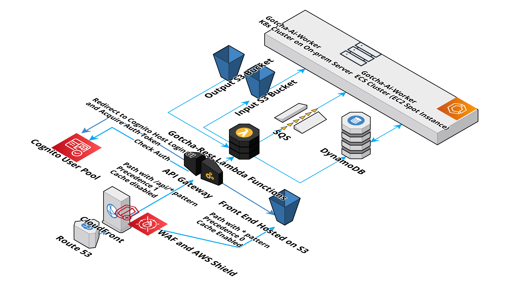

# Reactive messaging demo app that uses [Micronaut](https://micronaut.io/), [Reactor](https://projectreactor.io/), DynamoDB, SQS, S3, and written in [Kotlin](https://kotlinlang.org/)

## Summary

A demo app that pulls messages reactively (using Reactor Core) from SQS, downloads corresponding image on s3 bucket, generates a image with object detected, and uploads output image to S3, where status is stored on dynamo. 

The message and image should be generated by [gotcha-rest](https://github.com/liang121900/gotcha-detection-rest) which is a serverless app on AWS api gateway.

The front end can be accessed on [https://gotcha-dev.ga](https://gotcha-dev.ga).

It also provides a few endpoint for health check, and debuging.

## Object detection
The object detection program is based on [YOLO](https://pjreddie.com/darknet/yolo/)

## Postman Collection
There is a [postman collection](./doc/postman) on local folder for example request.

## General Flow Diagram


## DynamoDB table schema:


## To run locally (more details on the local folder)
- Install localstack if need to connect to the AWS services locally
- Run the create-local-aws-resource.py script to create the sqs, s3 bucket.
- The dynamoDb table should be created automatically when running the app locally.

## To build and run docker image that connect to the service on dev
```
gradle dockerBuild
docker-compose up dev
```
## To Deploy to cloud

1. copy Dockerfile from root to build/docker/main
2. Generate docker image (it could take a while)
   ```gradle dockerBuild```
2. Tag to a new version and then push
3. On ECS, update task definition and service definition to use the new image.


## Micronaut 3.7.3 Documentation

- [User Guide](https://docs.micronaut.io/3.7.3/guide/index.html)
- [API Reference](https://docs.micronaut.io/3.7.3/api/index.html)
- [Configuration Reference](https://docs.micronaut.io/3.7.3/guide/configurationreference.html)
- [Micronaut Guides](https://guides.micronaut.io/index.html)

---

- [Shadow Gradle Plugin](https://plugins.gradle.org/plugin/com.github.johnrengelman.shadow)

## Feature aws-v2-sdk documentation

- [Micronaut AWS SDK 2.x documentation](https://micronaut-projects.github.io/micronaut-aws/latest/guide/)

- [https://docs.aws.amazon.com/sdk-for-java/v2/developer-guide/welcome.html](https://docs.aws.amazon.com/sdk-for-java/v2/developer-guide/welcome.html)

## Feature object-storage-aws documentation

- [Micronaut Object Storage - AWS documentation](https://micronaut-projects.github.io/micronaut-object-storage/latest/guide/)

- [https://aws.amazon.com/s3/](https://aws.amazon.com/s3/)

## Feature dynamodb documentation

- [Micronaut Amazon DynamoDB documentation](https://micronaut-projects.github.io/micronaut-aws/latest/guide/#dynamodb)

- [https://aws.amazon.com/dynamodb/](https://aws.amazon.com/dynamodb/)

## Feature jms-sqs documentation

- [Micronaut AWS SQS JMS Messaging documentation](https://micronaut-projects.github.io/micronaut-jms/snapshot/guide/index.html)


